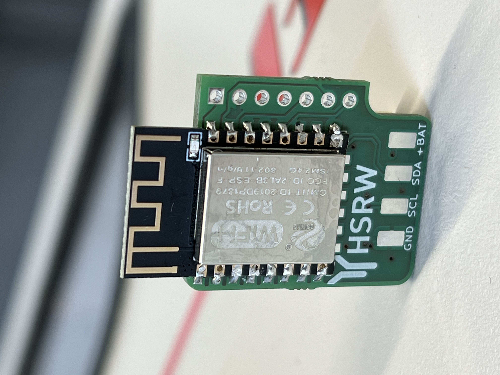
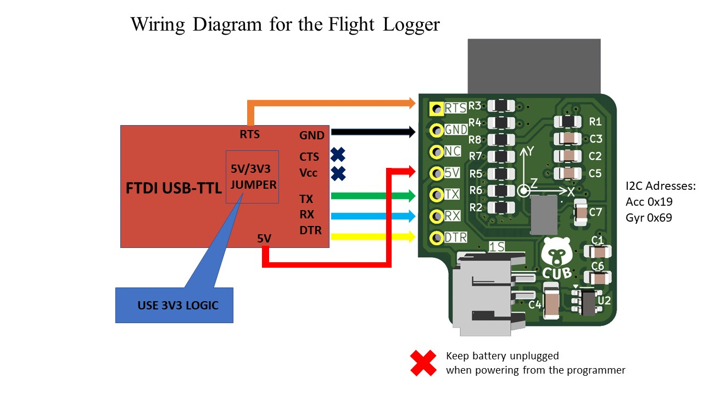

# Rocket Flight Logger

## Overview

**Rocket Flight Logger** is developed for messuring the acceleration of a pressurised rocket. The intial setup was d1-mini with esp8266 dev board and external IMU and battery connected with soldered wires. This project combines that into one board aiming to reduce all unnecessary weight.  

  
  

**Key Features:**
- 1S Bat connector on-board
- BMI088 IMU on-board
- Autoboot circuit simplified
- Minimal component count
- Programmer not part of PCBA

---

## Project Structure

| Folder | Description |
|--------|-------------|
| **CAD_files** | Contains `.stl` files  |
| **ECAD_files** | Contains PCB files |
| **Images** | ... |
| **Source_Code** | Firmware developed for this project |

---

## Wiring Diagram

How to program fresh boards.

  

---

## Final Results

PCB on the Rocket (pending)

---
## Future Work

Will be determined after more testing. 
  

## Author

Developed by **cubeli27**  
For questions or collaboration, feel free to reach out through GitHub.
